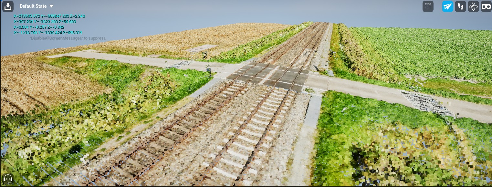

# Unreal Engine Point Cloud example
This is a full example for using Lidar Point Clouds from C++ in Unreal Engine 5.x. 

At the time of publication, Lidar Point Cloud support in UE 5.6.0 is broken. Use 5.5.4! The description below assumes that everything is set up for C++ development using Visual Studio 2022.

## How to use:
1. Create a new UE project, using the Collab Viewer (under Architecture) template. This template allows for clicking with the left mouse button and rotating the view while holding the right mouse button.
2. Enable the Lidar Point Cloud Plugin and restart the editor.
3. Throw out all unnecessary stuff, i.e. all existing geometry.
4. Create a new C++ class that derives from ALidarPointCloudActor and call it MyLidarPointCloudActor.
5. Copy the necessary code into the generated header and source files.
6. Set the path from where you want to load point clouds in line 56 of MyLidarPointCloudActor.cpp.
7. Build the project.
8. Run it from Unreal Editor.

## Functionality:
This code illustrates the following things:
1. Reading all LAZ files from directory and loading them. This assumes that auto centering is turned on (default setting for the Lidar Point Cloud plugin).
2. Aligning all point clouds and merging them into a single cloud.
3. Computing the offset between world and view coordinates.
4. Clicking on the point cloud and obtaining the clicked coordinate, offset and scaled back to world coordinates.

The documentation for the ULidarPointCloud class, which contains all necessary functionality like retrieving points, can be found here: https://dev.epicgames.com/documentation/en-us/unreal-engine/API/Plugins/LidarPointCloudRuntime/ULidarPointCloud
